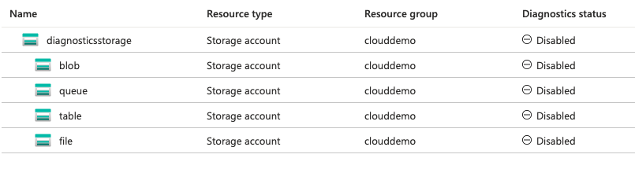

Azure have recently announced a new way to enable [diagnostic settings for storage accounts](https://docs.microsoft.com/en-us/azure/storage/blobs/monitor-blob-storage?tabs=azure-portal). For anyone that has used the Classic version of diagnostic settings (where you are given a ```$logs``` folder inside the storage account) - you'll share the same fear as me in that finding what you want from the logs is tricky at the best of times.

Using Azures Kusto Query Language in Log analytics, it is much easier to extract the insights that you need from the logs. 

## Enabling at each level

When enabling diagnostic settings in the past, it has been as easy as specifying the resource id and the metrics/logs you want (as well as where to send the logs, we'll assume log analytics for this blog).

This is where the storage account diagnostic settings differ. As you can see below, you essentially create a diagnostic setting at different levels within the storage account type.



Therefore, passing through the ID of the storage account won't enable the logs for blob, queue, table or file storage actions. This is also where Azure gets a little confusing and counterintuitive (more than it already is!).

When you click onto blob to create a diagnostic setting, the tree path at the top changes to look like this:


Like me, you may assume that this means that in order to create a blob, queue, table or file level diagnostic setting I need to pass through the resource id + /<blob, file, table, queue>. This is not the case, and I will show you how to do enable them at these levels later in the blog. 

## Terraform Support?

Providing your estate is in Infrastructure as Code, you'd be keen to enable this setting via that method. Thankfully you can do this, as demonstrated below for the storage account level:

```
resource "azurerm_monitor_diagnostic_setting" "example" {
  name               = "example"
  target_resource_id = data.azurerm_storage_account.example.id
  log_analytics_workspace_id = data.azurerm_log_analytics_workspace.example.id

  metric {
    category = "Transaction"

    retention_policy {
      enabled = false
    }
  }
}
```

to then apply diagnostic settings at the blob level:

```
 resource "azurerm_monitor_diagnostic_setting" "example" {
   name               = "example"
   target_resource_id = "${data.azurerm_storage_account.example.id}/blobServices/default"
   log_analytics_workspace_id = data.azurerm_log_analytics_workspace.example.id
   
   log {
    category = "StorageRead"
    enabled  = True

    retention_policy {
      enabled = false
    }
   }
   
   log {
    category = "StorageWrite"
    enabled  = True

    retention_policy {
      enabled = false
    }
   }
   
   log {
    category = "StorageDelete"
    enabled  = True

    retention_policy {
      enabled = false
    }
   }

   metric {
     category = "Transaction"

     retention_policy {
       enabled = false
     }
   }
 }
```

Those with advanced experience in Terraform may see an opportunity to use for-each here and loop over the resource to make this DRYer. I have not done this for demonstration purposes.

## Python

Older projects may not have the ability to manage all of their infrastructure through code, so [here]() is a python script that will enable the diagnostic settings at queue, blob, file and table level across all of your storage accounts. A service principal with the permissions to add diagnostic settings to storage accounts (as well as Read across the whole tenant) will be needed to run this script.

## Queries to run

Azure have some great queries to run [here](https://docs.microsoft.com/en-us/azure/storage/blobs/monitor-blob-storage?tabs=azure-portal#accessing-logs-in-a-log-analytics-workspace) for the logs that are generated from the diagnostic setting (including anonymous access to storage accounts!), so I won't add much here. The only other benefit I've seen is that you can monitor when sensitive file types (such as bacpacs) are placed into storage accounts with a query like so:

```
StorageBlobLogs
| where Uri contains "bacpac"
| where OperationName == "PutBlob"
```

Using a scheduled query alert rule can then fire an email to someone if this condition is met for further investigation.
