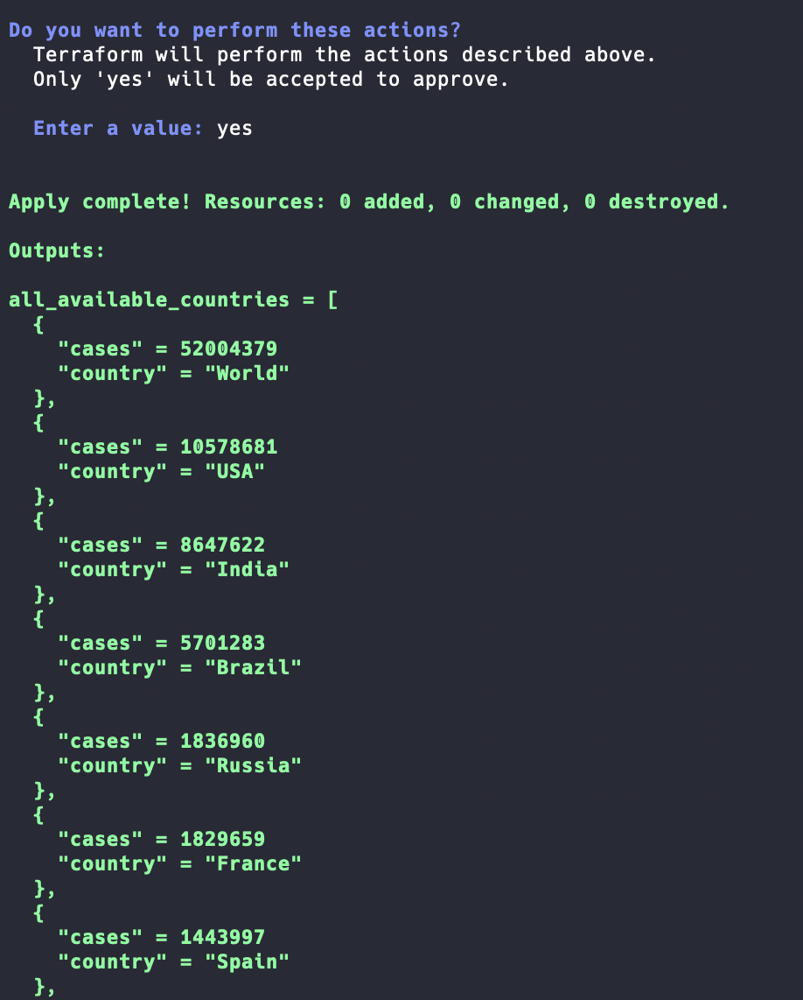

I've always wanted to get stuck into Go, but never really knew what a good starter project would be. That's when I discovered how to make a Terraform Provider. 

## The inspiration for the task

After taking annual leave so that I could do all the fun techy things that I never got round to doing (such as this blog!) - I decided that making a Terraform Provider would be interesting. I then came across this [blog](https://medium.com/spaceapetech/creating-a-terraform-provider-part-1-ed12884e06d7), that describes the Terraform SDK and all the features of it exceptionally well. It also provides a walkthrough for a resource block for a custom-made API. I would highly recommend checking this out! Without reading this blog, I would've struggled to understand what values like ```*schema.Resource``` or ```diag.Diagnostics``` mean.

Armed with this information, I decided I had two options. I could either create a Terraform resource provider for a given API (that I must be able to have some control of, such as Jira or a custom-made API), or to make a data provider for an API (which I don't have to own). As I am new to both Terraform provider development and Go, I decided that the latter would be easier and focus on what I really wanted to learn.

I then came across [this](https://github.com/circa10a/terraform-provider-mcbroken), a Terraform Provider for McBroken. McBroken is an API that returns numerous US states and the percentage of broken Ice Cream machines in that state. Whilst this Provider has very few use cases in the real world, it provided perfect scaffolding for me to try my hand at making my own provider.

## Choosing an API

I wanted to choose an API that forced me to change the Go files, so that I could actually learn something!

The McBroken API returns (shortened):

```
{"cities": [{"city": "New York", "broken": 23.91}], "broken": 10.61}
```

I then found a COVID stats API, which returned data in this format:

```
[{"country":"World","cases":51998148}, {"country":"India","cases":8647622}]
```

Subtle differences (and you could argue I chose an easier API), but a list response meant I had to think about the code and understand it in order to make it work. 

## The fun of Golang 

Given this was my first real project in Go, I came across many issues and cool parts of the go language:

* How do I even get the packages I need? ```go get github.com/hashicorp/terraform-plugin-sdk/v2/diag``` didn't work. What's the equivalent of a requirements.txt file and pip in go? What is a $GOPATH and why can't I run my code from anywhere on my machine? 
* What is a rune!? Why can't I iterate over my output? What is unmarshalling data? (Good answer to both questions [here](https://stackoverflow.com/questions/19310700/what-is-a-rune/47082770) and [here](https://stackoverflow.com/a/7255227))
* Oh, that's cool. If I'm not using a package or not using a variable after declaration then the program fails 

## The result

In the end, I was able to create two data sources in Terraform, a list of maps of all the countries and the amount of coronavirus cases, and another for the amount of coronavirus cases in a given country. As you can imagine, there was great joy when I saw this:



## Future Ideas

This was a fun task and I learned loads through completing it! In the future, I want to make my own API and try my hand at creating resource blocks for Terraform - stay tuned for that!

I also want to try a recommender for the current Terraform example using the Levenshtein distance between the user input and values in the JSON response, so that if a user was to pass through a country name of "Brasil" the Terraform would fail to apply but provide a useful message, such as:

```
Country 'Brasil' was not valid. Did you mean Brazil?
``` 

A simpler improvement of the code would be to ignore the first line of the JSON response (the world cases) and make that a separate data source, rather than residing in the ```covid_world``` data source.


To see the code for all of this, as well as examples - you can check it out [here](https://github.com/HarleyB123/terraform-provider-covid)
