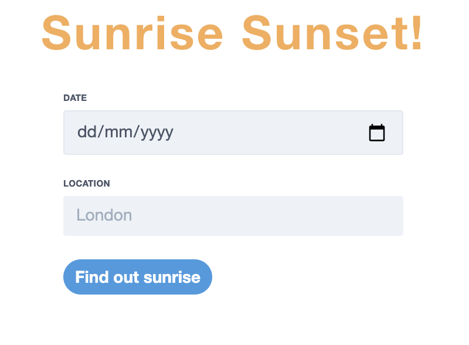

## Why I wrote a Kubernetes Operator

As Cloud services in general become more abstracted, I find myself wanting to go the other way more and understand the details "under the hood" for how interesting new technologies work. When it comes to Kubernetes, I feel the understanding is two-fold. Firstly, the extended understanding of containers themselves (something I still want to learn more about - a great resource [here](https://iximiuz.com/en/)) and then secondly, how Kubernetes works from a "How do you know I've deleted a pod and you need to create another to meet the needs of my deployment?" standpoint. For the latter, it felt like creating a Kubernetes Operator was a great hands-on way to understand this!

## What is an Operator?

Before going into the details on how to write an Operator, let's first talk about what an Operator actually is. For this, I like [RedHat's description](https://www.redhat.com/en/topics/containers/what-is-a-kubernetes-operator):

> A Kubernetes operator is an application-specific controller that extends the functionality of the Kubernetes API to create, configure, and manage instances of complex applications on behalf of a Kubernetes user.

An example of when an Operator is useful can be seen in this [ECK Operator](https://operatorhub.io/operator/elastic-cloud-eck). Imagine being responsible for the deployment and management of the different Kubernetes resources for this application. With an Operator, we can view and edit the application through one, or the case of the ECK Operator, multiple custom resources.

## Resources to write a Kubernetes Operator

When it comes to writing a Kubernetes Operator, there are quite a few [tools available](https://kubernetes.io/docs/concepts/extend-kubernetes/operator/#writing-operator).

Initally, I looked at KUDO - but the examples didn't work for me and I very quickly moved on to the [Operator Framework](https://sdk.operatorframework.io/). The documentation was much clearer for this and this [YouTube Video](https://www.youtube.com/watch?v=Uu9fwiJBckw) really helped solidify my understanding on the basics for writing an operator and what I need to do. Despite some of the commands that were run now being deprecated, I still recommend giving it a watch!

## Writing the Kubernetes Operator

When it came to deciding what my Kubernetes Operator should do, I wanted to make something that was quite simple, but that also interacted with the application (I didn't just want my operator to create a deployment/service and that's it!)

I decided that the "complex application" my Kubernetes Operator would control would be my not-so-complex [sunrise/sunset application](https://github.com/HarleyB123/SunsetSunriseMVC). Changing the home page header and title through an environment variable allowed me to make a custom resource that did "a thing" to the application, rather than just behind-the-scenes Kubernetes actions.

I won't go into the details of the operator sdk commands, as you can find them documented [here](https://sdk.operatorframework.io/docs/building-operators/golang/tutorial/), but I'll touch upon a few key files and commands needed for creating your Operator with ```operator-sdk```. If you want to follow along with my Operator, you can view the code [here](https://github.com/HarleyB123/harleyoperator):

- ```api/v1alpha1/sunrisesunset_types.go``` - This file defines the Spec and Status for your custom resource. Here I have set a Size and Title spec, which will be what I set in the custom resource YAML.
- ```controllers/sunrisesunset_controller.go``` - This is the main file for containing all the logic for the custom resource. In here, I define checks to see if a deployment/service already exist and if not, then create them. As well as this, I perform checks on whether the spec size or title settings and if so, update the deployment. Unlike the checks for the deployment/service, the reconciler will return ```return ctrl.Result{Requeue: true}, nil``` rather than ```return ctrl.Result{}, err``` on success, allowing for the Controller to requeue the request to be processed again.


## Deploying the Kubernetes Operator

You can watch the deployment of the Kubernetes Operator and it in action below - with the screenshots for the changed application UI!

[](https://asciinema.org/a/c1AIsEChtdRpD37M1CXOPU72R)

Here was the UI with the original custom resource setting



And here's the UI when I edited the sunrisesunset custom resource!


You can find the full code [here](https://github.com/HarleyB123/harleyoperator).
