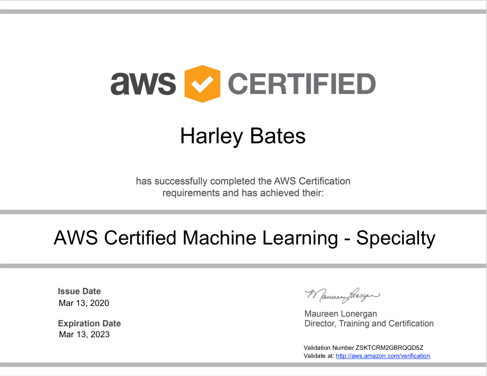

Given the wide range of Cloud and DevOps tooling certification available to take (and hopefully) pass - the AWS Machine Learning Specialty exam may not cross the mind of a Cloud Engineer.

## Why I chose to take the exam

Machine Learning is a growing and exciting field, yet the art of how predictions are made and business insights are delivered through this method seems magic to those who are not in a data science role. Understanding the terminology and roles of a data scientist can enable Cloud Engineers to understand the flow and transformation of data, thus allowing for optimised cloud-native solutions.

Typically, Cloud Engineers understand roughly what a developer is doing in their day-to-day operations and can recommend Cloud services quite easily. However, through taking this exam I have found that Machine Learning architectures can take many different forms depending on whether the data needs transformation, what analysis is being performed on the data and where the insight is being transferred to (public endpoint or a QuickSight dashboard?) 

## The exam itself

Unlike any AWS exam, the machine learning specialty exam has an entire domain that directly relates to Machine Learning - with **no** reference to AWS at all. Having no experience in Machine Learning, a lot of my time was spent working on this domain and figuring out the intricacies of different text-to-speech algorithms and whether the text needed an N-gram or OSB transformation.

Some questions in the exam go really niche, notably with Sagemaker, and ask you questions like: 

* What hyperparameter would you increase when using a specific Sagemaker built-in algorithm to remediate a given problem?
* What content types are supported by the XGBoost Algorithm?
* What can you do if the size of the training data exceeds that of the volume attached to the Sagemaker instance?
* What instance class is supported by the DeepAR Forecasting algorithm?

It goes without saying - reading the AWS documentation on Sagemaker multiple times is a **MUST** when wanting to pass this exam. 

Before analysis can occur on data, it must first be ingested and transformed. To my initial surprise - this exam requires a fair amount of knowledge of Kinesis and Glue. With Kinesis, there are very similar streaming options (such as Kinesis Data Analytics vs Kinesis Data Streams vs Kinesis Data Firehose) that without properly revising would cause you to slip up in the exam. With Glue, questions on the supported formats, the different input and output locations, and the configuration of Glue Crawlers are generally short and easy marks to pick up if you have studied this area thoroughly. 

Finally, a domain on building a secure, fault-tolerant, scalable, highly-available (insert many AWS Solution Architect buzzwords) machine learning solution. From a Cloud Engineer perspective and having passed the solutions architect exam, there isn't much to phone home about on this domain. Perhaps the only new topics that came up in this domain were around monitoring and visualising Sagemaker training models through Cloudwatch as well as Sagemaker Neo (edge machine learning service for providing inference to IoT devices).  

## How I passed this exam

Once I passed the exam - I made all my bookmarks from ~5 months of revision (you can do it in less - I just didn't feel a need to rush it) available [here](https://gist.github.com/HarleyB123/9edbce4f9ab8d08911170801590f929a). My main sources of revision came from Linux Academy for the content and Whizzlabs for the exam preparation. 

I finished the exam with a score of 772 

