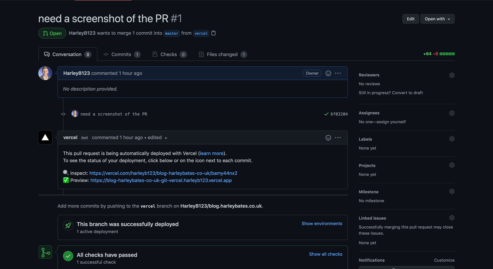
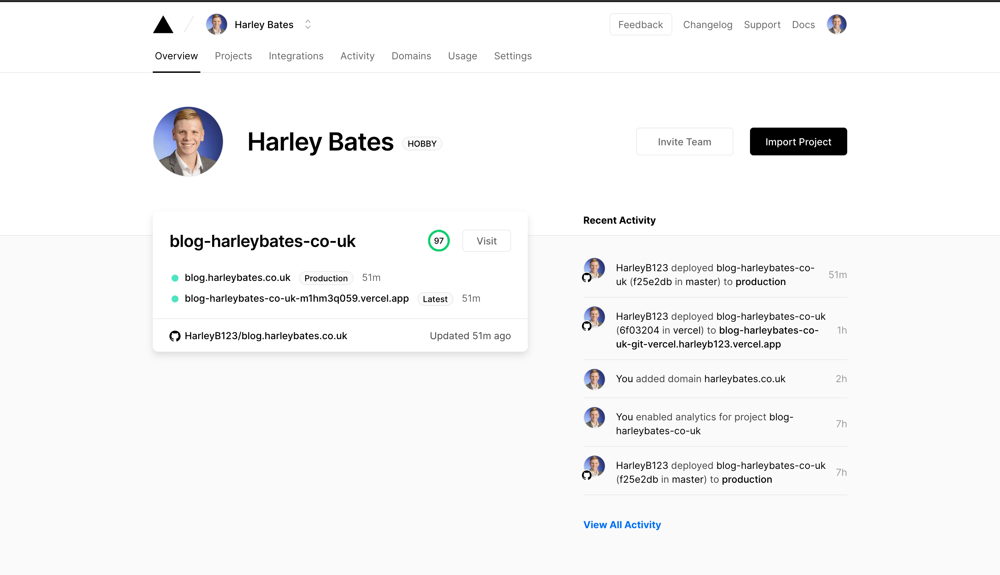

Vercel is a company that have created tools and solutions that are used by AirBnB, HashiCorp and Tripadvisor. Their language (called Next.js) is nothing new. It takes it's place comfortably in the ever growing (and ever popular) JAMstack solution. But it's not Next.js that makes Vercel so special, it's the platform they've built to deploy, configure and manage JAMstack sites all in one place!

## So what does Vercel actually do?

Let's go to the first cool part of Vercel - CI/CD in the platform. For Gatsby (what this site uses), a CI/CD pipeline using Github actions is nothing special. Neither is reviewing the site before it's live - ```gatsby develop``` can do that for me locally. Vercel really shines here though - as I demonstrate with a PR:



Note that in order to set-up this pipeline this is all I did:

- Signed up to Vercel using my Github account
- Said I wanted to use Gatsby (it does allow you to change things like the build command and output directory)
- Selected the repo where this blog is hosted

and that was it!

The PR gives me a link to the deployment (Vercel can store secrets/environment variables on it's end - much like any other CI/CD service) and then a preview website. For me, running Gatsby locally is *probably* faster, but for teams working on a site I'm sure this is pretty valuable. Also - the portal has such a clean UI:



You can also view any serverless function logs and the source code (your source code is stored in the portal, I sense some people/companies won't be too keen on this feature, given that Vercel is a third-party).

Speaking of integrations, you can also connect your favourite (well probably not at this time, but in the future!) plugins such as Slack, Formspree and Datadog to your deployments. I'll admit, this section of Vercel is sparce at the moment, but I see this becoming a great place to attach plugins and act as a one-stop shop for your entire JAMstack site.

On your main site overview, you can easily see your production deployment, as well as preview deployments (PR's). A previous history of these deployments is also available, as expected. What isn't though, is the analytics collected around the performance of your production website. In order to get this sort of information around your site usually, you'd have to setup a monitoring suite and extract these insights. Vercel collects the ```Real Experience Score```. This is something Vercel says they calculate using real data collected by users. This will then give you a score from 0-100 and then tell you how much better you are than the rest of the web. The score is a weighted average based some Web Vitals - which you can read mmore about [here](https://vercel.com/docs/analytics#web-vitals). You score can also be shown on a graph, where you can see how deployments have affected your overall sites quality. In short, it's a really nifty data collection tool (when you get enough traffic to the site to generate these metrics 😢).

## How does it compare to the rivals?

If you follow JAMstack sites to any extent, you'll know that the options to host them are seemingly endless. Netlify, Cloudflare pages, Github pages, Firebase, AWS Amplify (or S3/Cloudfront), the list goes on. Vercel are certainly up against some strong solutions. However, Vercel does offer exactly the same as Netlify and Cloudflare pages in terms of functionality. Comparing the pros and cons of each hosting solution is something that I'm certain many people have done before - so I will stick to the stuff Vercel does (in my opinion) better than Netlify and Cloudflare pages. 

The fact that I am able to deploy whatever project I want on the same platform in a near-identical way is incredible. Whether it's React, Vue, Hugo, Next.js or Docusaurus - getting setup on Vercel appears to be quite simple.

The analytics service I spoke about earlier. To collect all that data for me and provide the level of insight that it does is really cool and a feature that it doesn't look like Netlify or Cloudflare pages offer *for free*.

This leads me on to the final thing I love about Vercel - their free (they call it 'Hobby') tier. For *free* (I can not highlight this enough) you get:

- HTTPS-enabled Custom Domains
- Continuous Deployment with Git
- High-performance Edge Network
- **Unlimited Websites & APIs**
- Serverless Functions in Node.js, Go, and more
- The analytics service (can only see performance for the last day though)
- Use of the [Vercel CLI](https://vercel.com/docs/cli#introduction/vercel-cli-reference) 

I am amazed at how good that is, you only need to checkout the Cloudflare pages beta site or Netlify's pricing to see how good of a deal this is.

## How easy was it to migrate from AWS?

Whilst all of this looked really cool - I was worried about how difficult it would be to transfer stuff over and use Vercel to host my site, rather than my own S3/Cloudfront. At this point I should point out that technically I have sacrificed the service SLA (the enterprise feature gives you 99.99% SLA, which still isn't as good as S3) - but if I'm honest for a blog site I don't really care. The development features I am provided with outweigh this.

In order to get the site up, all I had to do was either add or transfer my domain to the Vercel site. I chose to add the domain, which meant removing the old A record that pointed to my Cloudfront distribution and instead create a CNAME in Route53. That was it.

Like the rivals, Vercel gives you HTTPS via LetsEncrypt. You can add your own custom certificates to the site if you wish (I am only just noticing these features now whilst I check what I am writing to be true - the offering truly is incredible!).

